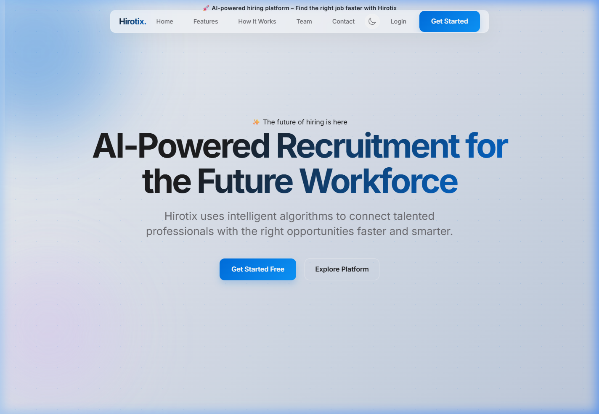
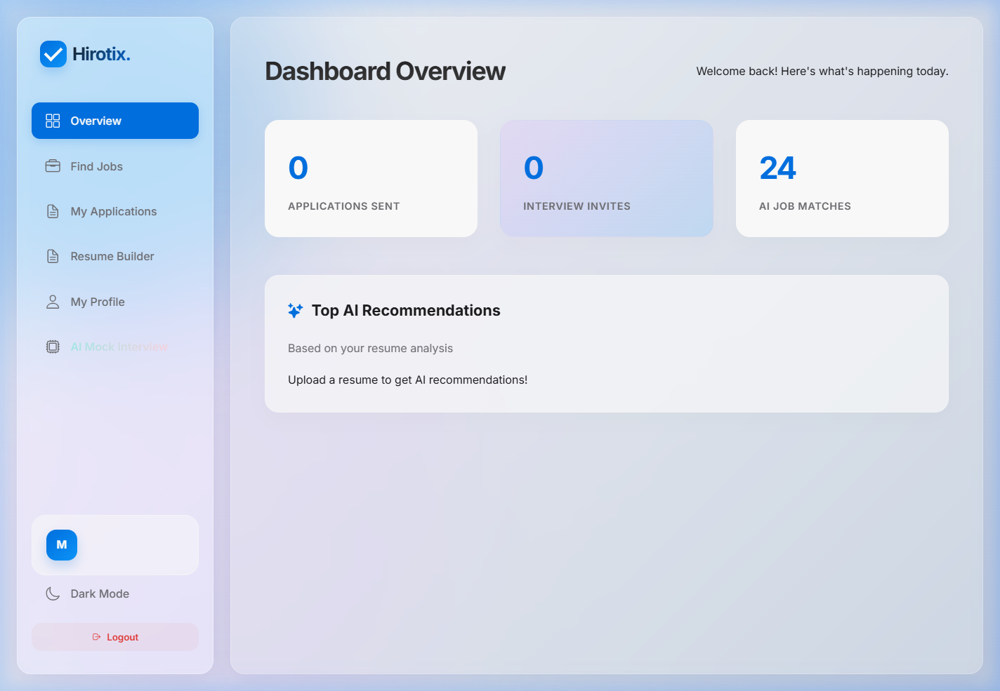
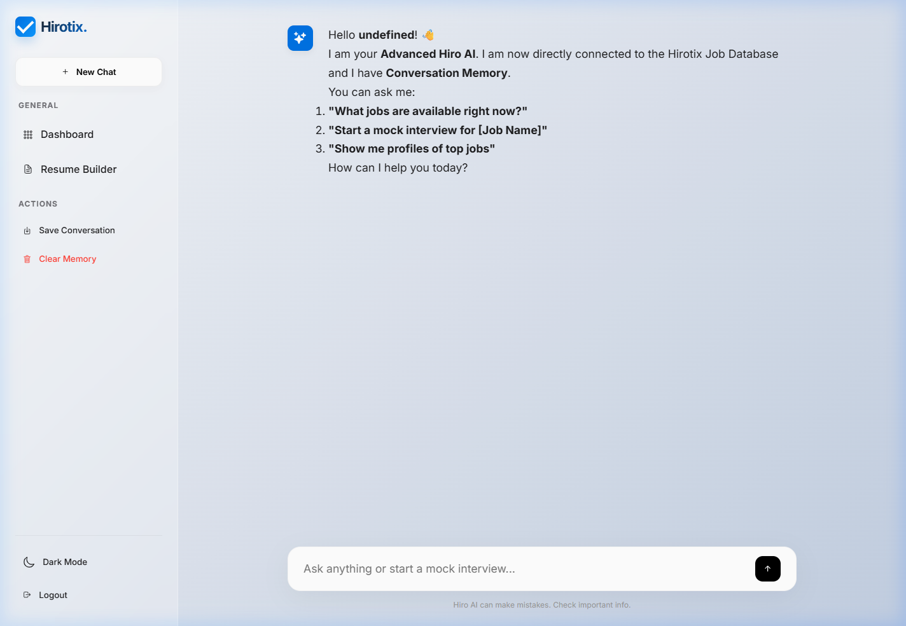
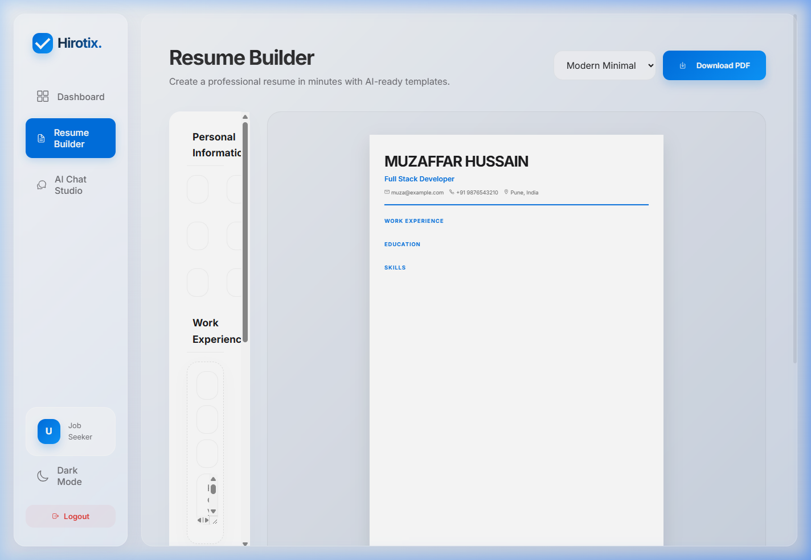

# 🚀 Hirotix - AI-Powered Recruitment Platform

Hirotix is a premium, high-performance recruitment ecosystem that bridges the gap between talent and opportunity using advanced AI. From intelligent resume parsing to context-aware mock interviews, Hirotix redefines the hiring experience with a world-class UI/UX.

---

## ✨ Visual Showcase

### 💎 Premium Landing Experience
Dynamic Island navigation with elastic glassmorphism and animated hero gradients.

### 📊 Intelligent Job Seeker Dashboard
Centralized hub for AI job matches, application tracking, and profile management.

### 🤖 AI Mock Interview Studio
Real-time conversational intelligence powered by Llama 3.1 for immersive career preparation.

### 📄 AI Resume Intelligence
Seamlessly build and optimize high-conversion resumes with AI-driven templates.

---

## 🛠️ Technical Excellence
Hirotix utilizes a distributed architecture to ensure scalability and intelligence.

- **Frontend**: High-fidelity UI built with modern HTML5, CSS3 (Glassmorphism), and Vanilla JavaScript.
- **Backend (Core)**: Robust Java Spring Boot application handling business logic and security.
- **AI Brain**: Python Flask microservice orchestrating LLM calls to Groq API (Llama 3.1).
- **Database**: High-performance MySQL for structured data persistence.

---

## 🧠 Advanced AI Capabilities
- **Resume Parsing**: High-precision text extraction from CVs.
- **Semantic Matching**: Intelligent scoring of candidates against job descriptions.
- **Interview Simulation**: Context-aware AI persona for mock interview practice.
- **Hallucination Prevention**: Strict system prompts and database context filtering.

---

## 🚦 Getting Started
For detailed instructions on setting up the database, backend, and AI service, please refer to the **[Project Startup Guide](docs/START_PROJECT.md)**.

For a deeper dive into the system design, check the **[Architecture Documentation](docs/ARCHITECTURE.md)**.

---

### 👨‍💻 Developed By
**Muzaffar Hussain** & **Sayyed Guftan**  
Under the guidance of Prof. Mahwish Momin & Prof. Affan Khan.
