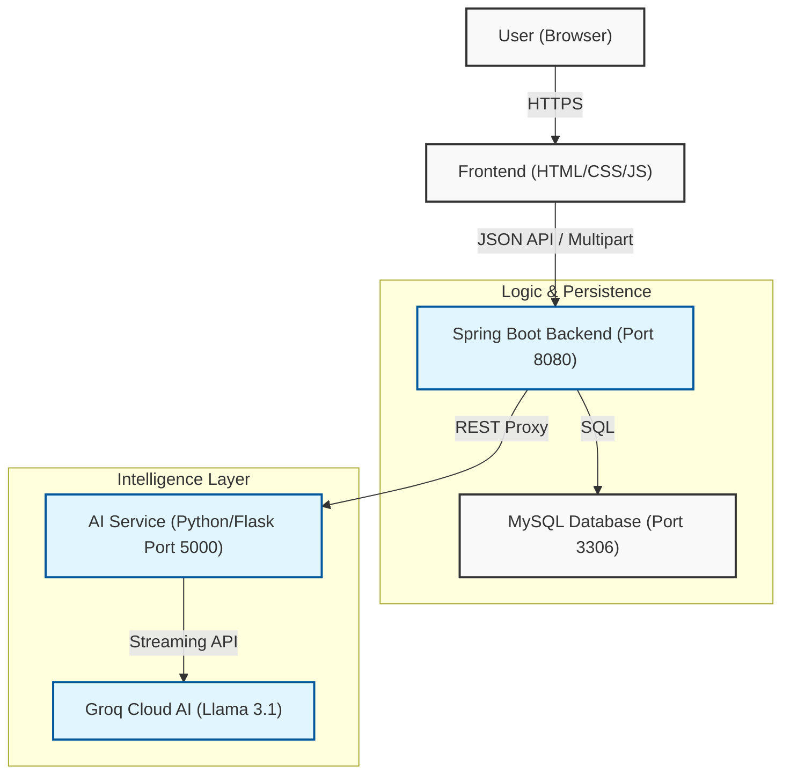

# Hirotix Technical Architecture

Hirotix is built on a modern, distributed architecture that leverages the strengths of multiple technologies to provide a high-performance, AI-driven recruitment experience.

## System Overview

The application follows a triple-tier architecture:
1.  **High-Fidelity Frontend**: Built with HTML5, CSS3, and modern JavaScript API consumers.
2.  **Robust Java Backend**: Spring Boot handles business logic, security, and data persistence with MySQL.
3.  **Intelligent AI Pipeline**: A dedicated Python Flask service powered by the Groq API (Llama 3.1) for resume parsing and real-time chat.

## Information Flow

## Communication Protocol
- **Cross-Origin Configuration**: Implemented via `CorsConfig.java` to allow secure communication between the frontend and distributed backend services.
- **Structured Data**: All inter-service communication utilizes DTOs (Data Transfer Objects) like `ChatRequest.java` to ensure type safety and schema consistency.
- **Asynchronous Processing**: Resume parsing results are asynchronously mapped to job descriptions for real-time AI scoring.
