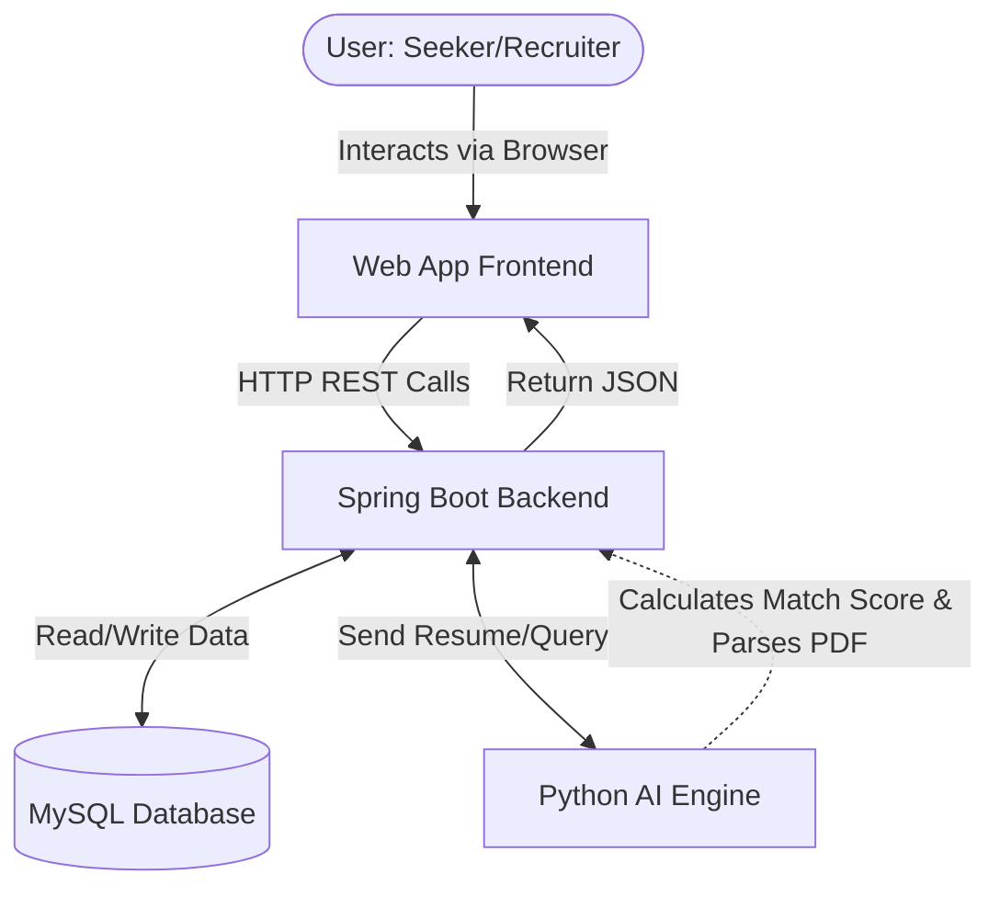
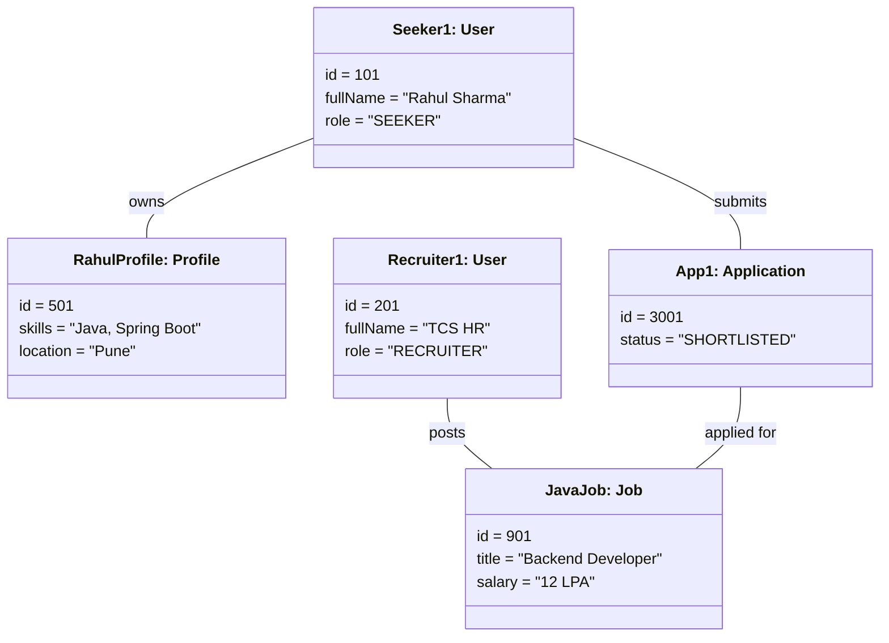
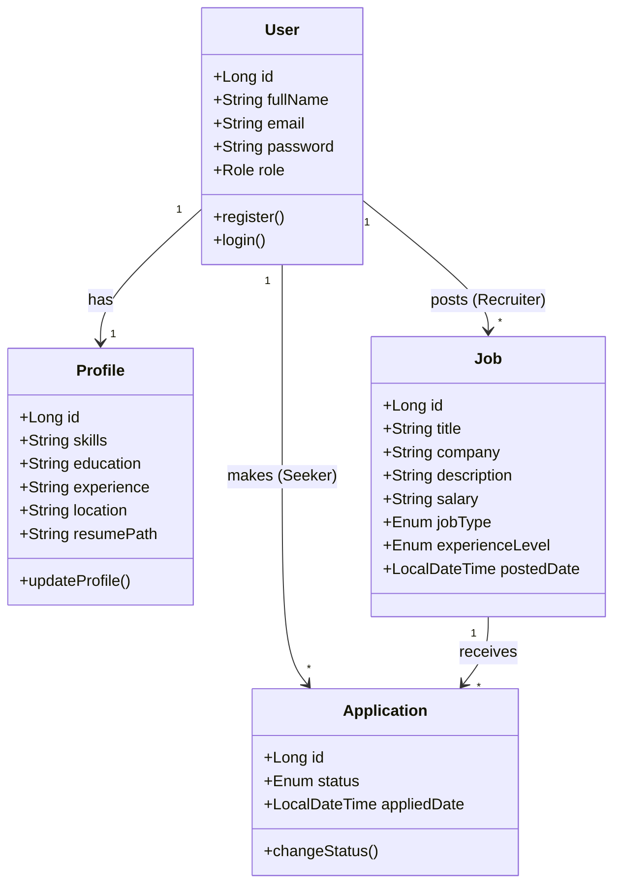
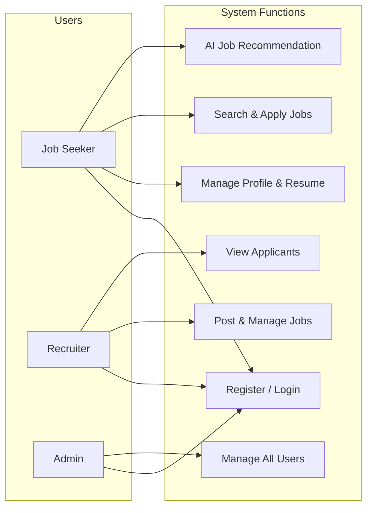
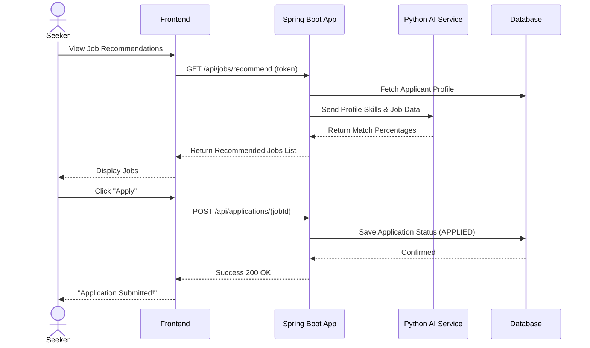
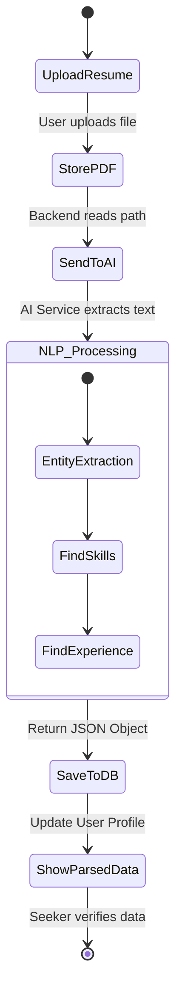
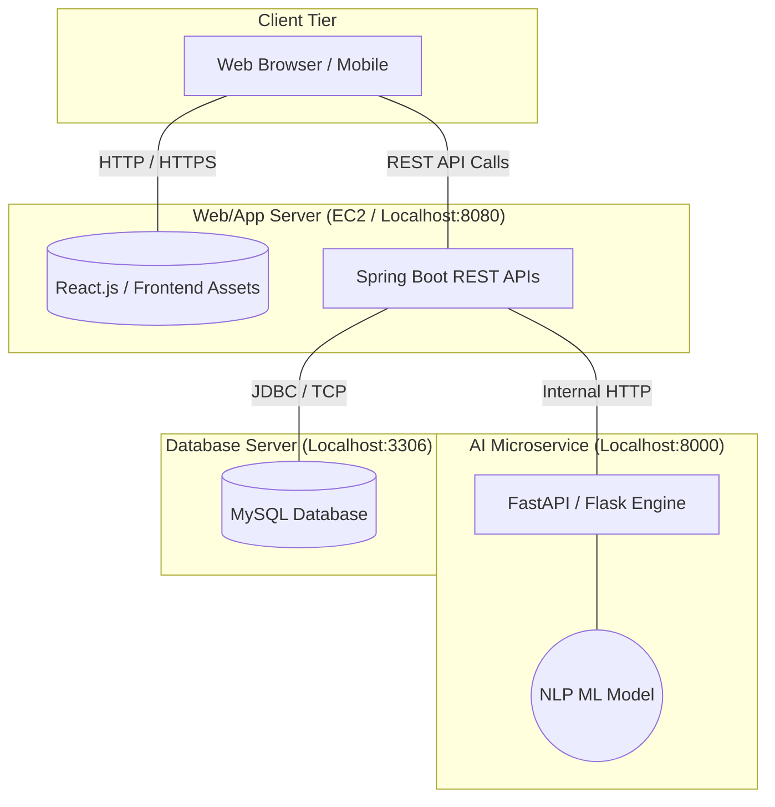
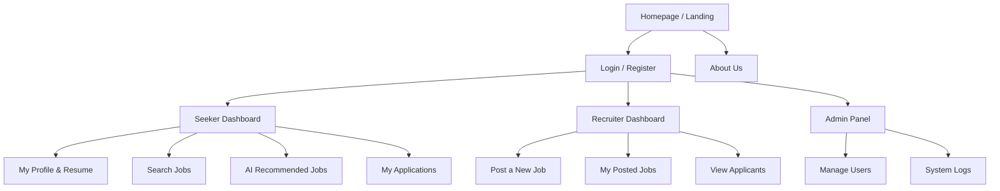

# Hirotix AI Job Portal - UML & System Diagrams

This document contains the visual representation of the final architecture and UML diagrams for the **Hirotix Intelligent AI-Powered Job Portal** as per the guide's requirements.

> **Note to user:** These diagrams are generated using Mermaid.js. In standard markdown viewers (like GitHub, VS Code, or Typora), these code blocks will automatically render into proper visual diagrams. 

---

## 1. System Flow Diagram
This shows how data flows between the user and the system's core components: the Frontend, Backend, AI Engine, and the Database.

---

## 2. Object Diagram
An object diagram shows a specific snapshot of the system at runtime, demonstrating how objects relate to each other.

---

## 3. Class Diagram
This represents the static structure of the database entities and the core backend models.

---

## 4. Use Case Diagram
This illustrates the actors (users interacting with the system) and the actions they can perform.

---

## 5. Sequence Diagram
This tracks the chronological sequence of interactions when a Job Seeker applies for an AI-Recommended job.

---

## 6. Activity Diagram
This shows the step-by-step workflow (logic flow) of the AI Resume Parsing component.

---

## 7. Deployment Diagram
This maps out the physical architecture of where the software will be hosted and executed in a production environment.

---

## 8. Website Map Diagram
This illustrates the hierarchical navigation and structure of the application's user interface.

